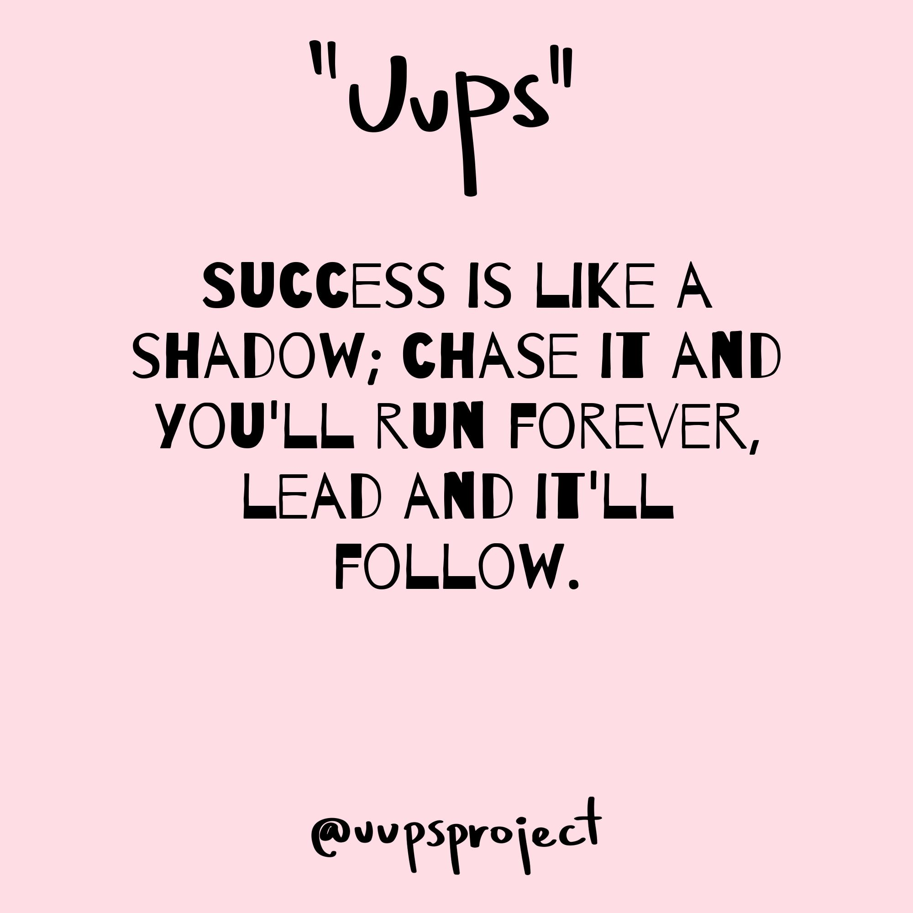
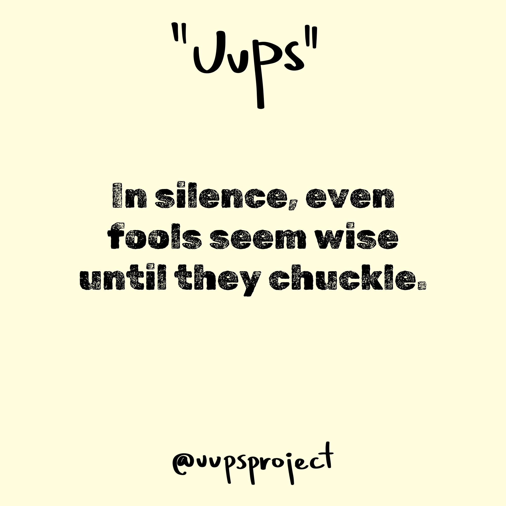
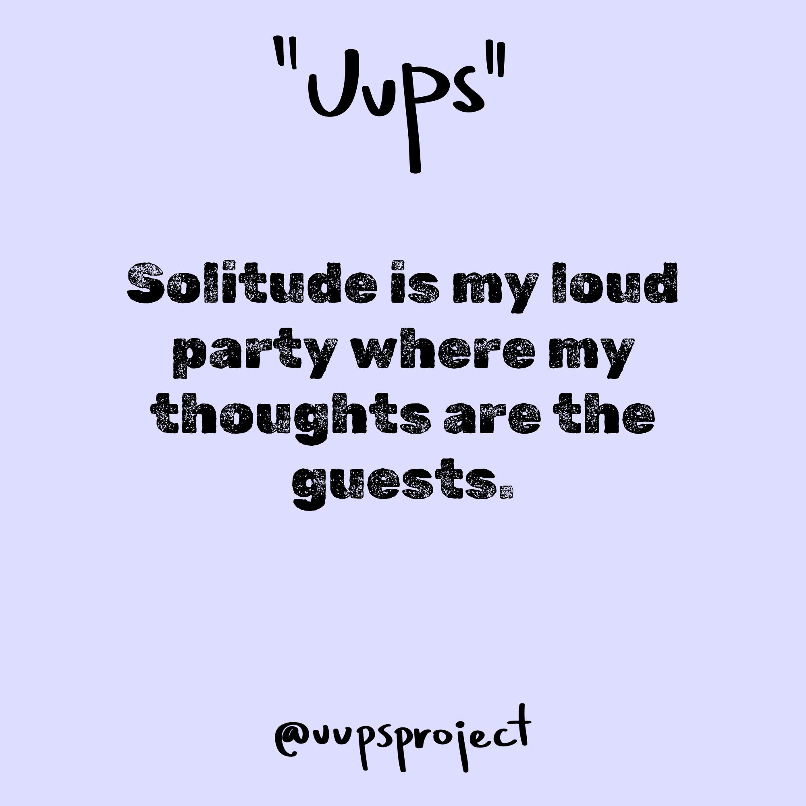
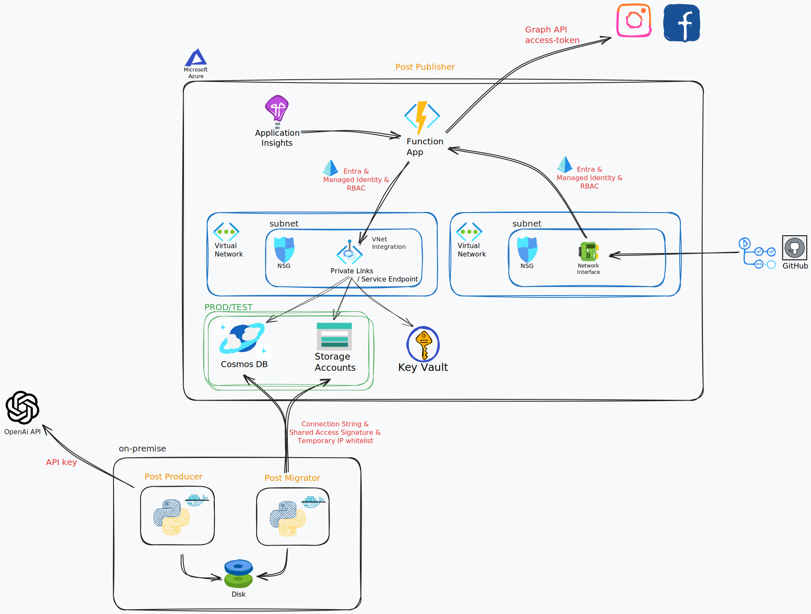

# UUPS Project
The UUPS Project automates the generation and publication of image posts to social media accounts with the help of LLMs as post authors. 

The selected LLM is tasked to generate meaningful and catchy quotes and post captions. The quotes are then placed on some default backgrounds to form images. Together with the captions, these image posts are then periodically published to predefined social media accounts with the help of a serverless Azure architecture.
- The background images and their style were designed by a dear friend.

> [!IMPORTANT]
> The application code is meant to serve as a reference. Please review the project and incorporate your security governance, audits and conventions before using it in a production setting.

The underlying architecture that automates this porcess consists of three components:
- [Post Producer](https://github.com/boskrisz/uups-project/tree/master/post-producer): on-premise application that generates the image posts with the help of an LLM
- [Post Migrator](https://github.com/boskrisz/uups-project/tree/master/post-migrator): hybrid application that migrates the approved posts to Azure
- [Post Publisher](https://github.com/boskrisz/uups-project/tree/master/post-publisher): cloud-native Azure Function App that periodically publishes these posts to the selected social media accounts

Examples of generated images with their captions:
| | |
|:-------------------------:|:-------------------------:|
| |  |
| Following shadows leads to light. #success #ambition #leadership #irony #chaseyourdreams #funnytruths #lifeadvice #wittywisdom | Irony in tranquility. #reflection #contemplation #silence #wisdom #irony #deepthoughts #quietmoments #introspection #mindfulmirth |
| |  |
| When alone becomes too loud. #solitude #isolation #thoughtparty #ironic #peacefulnoise #introvertjokes #selfreflection | Crafting meaning in ten words or less. #language #communication #irony #wit #gratitude #funny #speakwisely #wordsmatter |

## Architecture

**Post Producer**

The Post Producer component is a simple on-premise Python application that sends quote and caption generation requests to a given LLM, and places those on predefined image backgrounds that comply with most social media standards. 

The generated images are saved on the local disk, where the user can review them. The approved images will be accessible for the Post Migrator application, which handles these assets' migration to Azure.

The application can be run via Docker or from a Virtual Environment, and its local development is supported via DevContainers. It has some basic unit and integration tests written with `pytest`, which are evaluated by a GitHub Action on each pull request or push to the master branch.

Setting up and using the application is documented under its own directory at [`/post-producer`](https://github.com/boskrisz/uups-project/tree/master/post-producer).

**Post Migrator**

The Post Migrator component is a simple hybrid Python application that migrates the approved images and their metadata to Azure cloud.

Regarding the security, the Post Migrator authenticates via a Connection String and a Shared Access Signature (SAS) with the Cosmos DB and Blob Storage Accounts respectively. 
- This authentication is needed only around once a year, as approving 1000 images takes around an hour and with a success rate of 70% the system will work for 700 days without any manual intervention (given 1 post per day configuration). Therefore, whitelisting the on-premise server's IP address for this short duration is satisfactory given the project's properties.

The application can be run via Docker or from a Virtual Environment, and its local development is supported via DevContainers. It has some basic unit and integration tests written with `pytest`, which are evaluated by a GitHub Action on each pull request or push to the master branch.

Setting up and using the application is documented under its own directory at [`/post-migrator`](https://github.com/boskrisz/uups-project/tree/master/post-migrator).

**Post Publisher**

The Post Publisher component is a simple cloud-native system that is responsible for the automated publication of the approved posts to the selected social media accounts. 

It works with various Azure resources and its logic is orchestrated via a serverless Function App. Within the Function App, a time trigger based Python function is hosted that is binded to the Blob Storage and CosmosDB Accounts, where the approved images and their metadata are stored.

Regarding the security, the application uses a Key Vault to store the social media account's credentials, while all other authentication between the Azure services are carried out via Microsoft Entra ID's service principal features, such as System - and User Managed Identities and Federated Credentials. Moreover, the authorization is restricted by Role Based Access Control (RBAC) assignments. 

Furthermore, the system's security can be further advanced by reducing the services communication to Azure's private network and disabling all public access points. Implementation details can be found under [`/post-publisher`](https://github.com/boskrisz/uups-project/tree/master/post-publisher).

The Function has some basic unit and integration tests that are evaluated during the CI/CD workflow before the application is packaged and deployed to the Function App container on Azure.

Setting up and using the application locally is documented under its own directory at [`/post-publisher`](https://github.com/boskrisz/uups-project/tree/master/post-publisher).

## Project Requirements
As the system is quite simple, its Functional and Non-functional requirements were also kept minimal. However, it is important to highlight them as they guided the development process.

### Functional Requirements
- **General Functionality**: The application generates quote-based image posts with the help of an LLM, and publishes them to social media accounts.
- **Automation**: The application works with as minimal intervention as possible. The posts are generated and published automatically. The only manual intervention is needed to approve the posts before they are published. 
    - For example, reviewing a 1000 generated posts takes around an hour, and with a success rate of 70% the system will work for 700 days without any manual intervention, when 1 post per account per day is configured.
- **Cost Efficiency**: The application works with as minimal costs as possible. When the application is idle, it does not generate any costs.

### Non-functional Requirements
- **Scalability**: The application has the capability to scale-to-zero to save costs, as most of the time it is idle.
- **Performance**: As there are no incoming requests to the system, serial- and concurrent request processing requirements are not needed. There are only a few small-sized outgoing requests per day, which does not require in-depth performance considerations.
- **Availability/Redundancy**: Outside of backing up the posts, no stateless and stateful redundancy considerations are needed. Fault detection is instrumented to have alerts when a possible maintenance is needed.
- **Security**: As there are no incoming requests to the system, public access points can be removed and communication is reduced to a private network. Authentication of the services is required, while their permissions are authorized via a Role Based Access Control (RBAC) system. Secrets are stored encrypted in a centralized location and are kept minimal. Throughout the whole communication the least permission principle is followed.
- **Other considerations**: The system is modular and extendible for future use cases, such as managing multiple projects' multiple social media accounts. Additionally, the application components are easily testable and the code is written by following manageability best practices.

## Usage Costs
Developing systems on the cloud is all about cost management. If it would be cheaper to provision on-premise, then why bother.
Maintaining this system derives the following costs on Azure for a single year:

OpenAi API (~$0.149)

    - Model used: `gpt-4o-mini`.
    - Input tokens for 522 posts (~300 per request): $0.024
    - Output tokens for 522 posts (~400 per request): $0.125
    - 522 posts equals to 365 approved posts when failure rate is 30%.
    - Pricing: https://openai.com/api/pricing/

Azure Storage Account (~$0.01024)

    - Tier: Standard Performance, Standard GPv2 storage, Flat namespace, LRS, West Europe
    - Blob Storage Access Tier: Cool (cheaper than Hot and Cold by approx. 30%)
    - Uploading 365 images (Data Write & Write operation): $0 + $0.0034
    - Storing the 365 images for a year (1 image is 176KB): $0.006
    - Reading the 365 images (Data Retrieval & Read operation): $0.0005 + $0.00034
    - Pricing: https://azure.microsoft.com/en-us/pricing/details/storage/blobs/

Azure Cosmos DB Account (~$2.7828)

    - Tier: No availability zone, No geo-redundancy, Serverless capacity, Backup every 24h with retention of 2 days, Relaxed consistency level, West Europe
    - Cumpute: 1x Create (~16 RU with indexing), 1x Read (1 RU) and 1x Update (10 RU) operations for 365 image metas (1 meta is approx. 1KB): approx. 10k RU per year = $0.0028
    - Storage: 365 image metas (1 meta is approx. 1KB): $2.78 due to Azure's minimum 1GB requirement
    - Bandwidth: $0 as within limit
    - Pricing: https://azure.microsoft.com/en-us/pricing/details/cosmos-db/serverless/

Azure Key Vault (~$0.002)

    - Reading 2 secrets 365 times: $0.002
    - Pricing: https://azure.microsoft.com/en-us/pricing/details/key-vault/

Function App (~$0.144)

    - Tier: Consumption plan
    - Execution time (~3 seconds per execution): $0 due to free grant per month
    - Executions (365 per year): $0 due to free grant per month
    - Storage Account (LRS, GPv2, Standard): difficult to estimate due to high variability in logs and deployments, but for 1 month it was around $0.012, which is ~$0.144 for a year

Microsoft Entra ID ($0)

    - Tier: Free tier
    - User, Managed and Federated Identities: $0
    - Azure RBAC: $0

Application Insights (~$0.12)

    - Tier: Pay-as-you-go model, Basic Logs, no metrics, not alerts, no tests, no extra logs
    - Basic Logs: difficult to estimate, but after 1 month of running it generated less than $0.01
    - Pricing: https://azure.microsoft.com/en-us/pricing/details/monitor/

Data Transfer (~$0.0046)

    - Communication within Azure's private network in same Availability Zone: $0
    - Internet Egress (approx. 176KB per image): ~$0.0046
    - Pricing: https://azure.microsoft.com/en-us/pricing/details/bandwidth/

Test environment (~$2.801)

    - Test Blob Storage:
        - No persistent storage requirement, only read and write
        - If integration tests are executed 365 times a year (3 write, 4 read, 3 delete): $0.0135
    - Test Cosmos DB Account:
        - No persistent storage requirement, only read and write
        - If integration tests are executed 365 times a year (7 write, 6 read, 7 delete = ~230 RU): $0.021
        - Even though no items will be stored, due to Azure's minimal monthly rounding: $2.78

Simple enhanced security - private communication (~$0.001)

    - Virtual Networks and Subnetworks: $0
    - Service Endpoint: $0
    - Virtual Network Integration:
        - Function App needs to change Plan from Consumption to Flex in order to have this feature. Both can scale to zero and due to the minimal daily usage the additional cost of maintenance is neglegible.

Advanced enhanced security - private communication and no public access points (~$262.8)

    - Virtual Networks and Subnetworks: $0
    - Private Endpoint: 
        - Yearly fee: $87.6 * 3 = $262.8
            - Considering only the PROD services 
        - Inbound data processed (365 CosmosDB updated documents): < $0.001
        - Outbound data processed (365 CosmosDB retrieved documents + 365 read blob metas + 700 secret read): < $0.001
    - Virtual Network Integration:
        - Function App needs to change Plan from Consumption to Flex or Premium to have this feature. Both can scale to zero and due to the minimal daily usage the additional cost of maintenance is neglegible.

 

**Total cost of the system per year**
- With simple enhanced security: $6.0
- With simple enhanced security and without a test environment: $3.2
- With advanced enhanced security: $268.8

Please note that these are still estimates, especially as some other hidden costs might still occur.

**Cost saving opportunities**
- For a negligible cost saving, the blob's lifecycle can be managed more efficiently with rule-based policies. For example, the already processed images can be moved to the Archive Access Tier, or simply expire and delete them as re-creating the images from the stored meta information is an easy process (if ever would be needed).
- Instead of storing the image metas in a Comso DB, they could be stored in a Blob Storage as JSON files or in Azure Table Storage. This would save the Cosmos DB's minimum 1GB requirement, saving approximately $5.4 per year ($2.7 for PROD and for TEST each). However, this would impede the efficient maintainability of the application when it is extended to multiple projects with multiple social media accounts.
- The integration tests for the TEST environment could be run only when a PR is opened for the master branch. Although its savings would be insignificant as the majority of costs come from the minimum 1GB storage requirement of Cosmos DB.

Applying these options could reduce the yearly cost of the system to around $0.5.

**Conclusion**

The cheapest low performance unmanaged Linux VPS that I have found so far was around $4/month, which equates to $48 per year. In contrast, the cheapest solution on Azure is around $0.5. This is a 96x cost reduction. By considering the possible hidden fees of the VPS provider, and the saved development time due to using PaaS on Azure, it is clearly a worthy investment to go with a cloud solution.

As some final thoughts regarding cost management, imagine running 10.000 projects with their own social media accounts. Of course it would come with additional non-linear costs and extra service expenses to avoid rate limiting, but its cost would be in the thousands of dollars. Then if these accounts are extended to not only produce simple text based images, but to use the multi-modality of the latest LLMs or specialized generative models (e.g.: for detailed images, avatar influencers, virtual bands, ad videos etc.), then one might image how vastly different the internet will be in the upcoming years...
