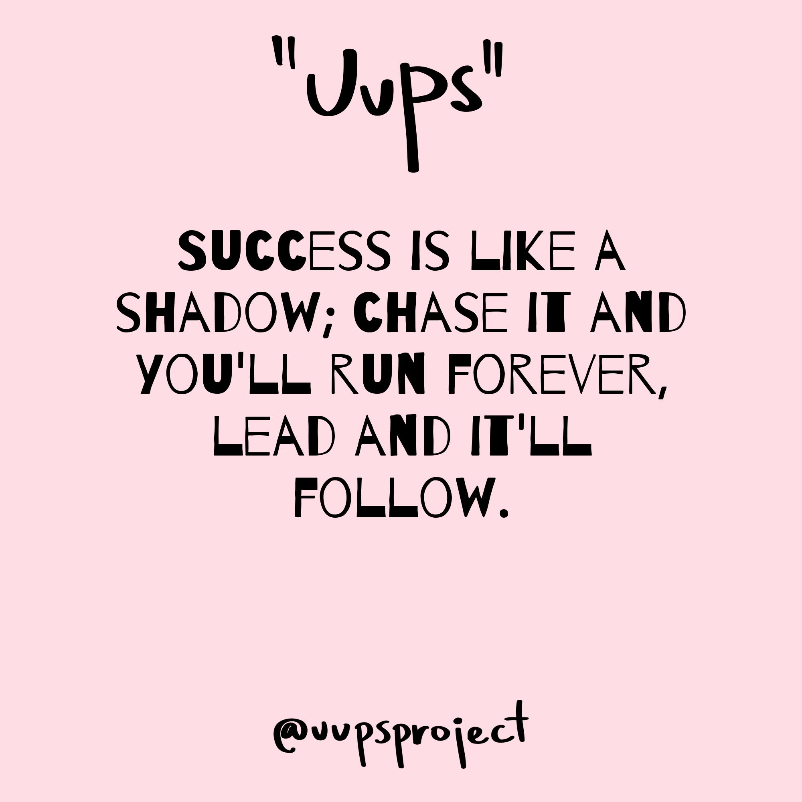
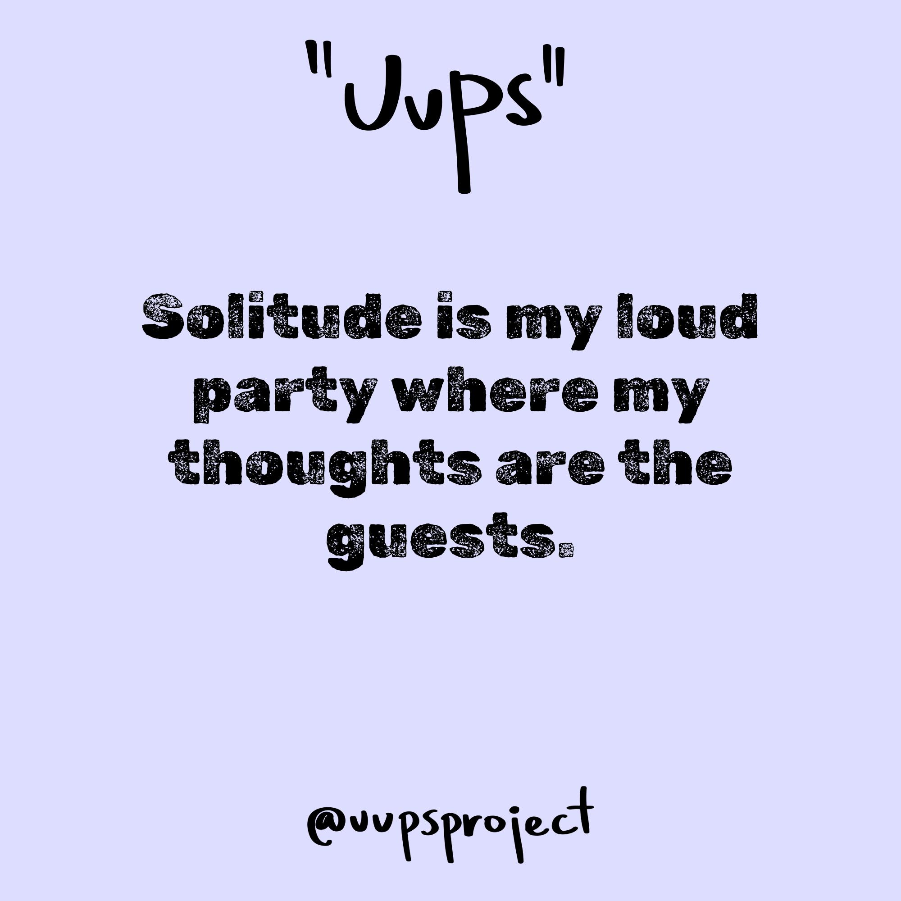

# UUPS - Post Producer
The "_UUPS - Post Producer_" application is one of the service components of the UUPS project.

This application is used to generate images with quotes by utilizing an LLM to come up with the quotes themselves.
The generated images have the format to be posted on social media, and the LLM also writes relevant post captions for this purpose.
Their automated publishing to Instagram is handled by the "_UUPS - Post Publisher_" application.

The base images and their style were created by a dear friend.

Examples of generated images with their captions:

| | |
|:-------------------------:|:-------------------------:|
| |  |
| Following shadows leads to light. #success #ambition #leadership #irony #chaseyourdreams #funnytruths #lifeadvice #wittywisdom | Irony in tranquility. #reflection #contemplation #silence #wisdom #irony #deepthoughts #quietmoments #introspection #mindfulmirth |
| |  |
| When alone becomes too loud. #solitude #isolation #thoughtparty #ironic #peacefulnoise #introvertjokes #selfreflection | Crafting meaning in ten words or less. #language #communication #irony #wit #gratitude #funny #speakwisely #wordsmatter |


## Usage
First, configure the environment variables in the ``post-producer/config/.env`` file:
- ``OPENAI_API_KEY``: Your API key to access OpenAi. More can be read under [here](https://openai.com/index/openai-api/).
- ``OPENAI_MODEL``: the LLM that is used to generate the quote and caption.
   - Options and their pricing can be found [here](https://openai.com/api/pricing/).
   - By default, the ``gpt-4o-mini`` is used due to its outstanding cost efficiency (around $0.150 / 1M input tokens) and performance. 
   - However, the best results were achieved by ``gpt-4-1106-preview`` (around $10.00 / 1M tokens).

Running the application to generate images can be done via at least the following ways:
- Docker
- Python Virtual Environment

The generated images and their metadata will be saved to the `uups_projec/generated_assets` directory.
This directory is shared with the post-migrator application.

**Docker**

Requirements:
- Docker

Build an image from the application and run it in a container with persistent storage mounted to the local `generated_assets` directory:
```bash
# from root dir: uups_project/
docker build -t [img_name] ./post-producer
docker run -v $(pwd)/generated_assets:/generated_assets -e IMAGE_NUM=[num_images] [image_name]
```
- `num_images`: The number of images to be generated
- `image_name`: The name of the Docker image to be built

**Python Virtual Environment**

Requirements:
- Python 3.x

Create a virtual environment to store the installed dependencies and run the application:
```bash
cd post-producer/

python3 -m venv .venv
source .venv/bin/activate
python3 -m pip install -r requirements.txt

python3 -m app --image_num [num_images]
```
- `num_images`: The number of images to be generated


## Development via DevContainers
Documentations about DevContainers:
- [Microsoft - Dev Containers: Getting Started](https://microsoft.github.io/code-with-engineering-playbook/developer-experience/devcontainers/)
- [GitHub - Introduction to dev containers](https://docs.github.com/en/codespaces/setting-up-your-project-for-codespaces/adding-a-dev-container-configuration/introduction-to-dev-containers)
- [Visual Studio Code - Developing inside a Container](https://code.visualstudio.com/docs/devcontainers/containers)

**Requirements:**
- Docker installed and running on your OS
- VS Code and Dev Containers extension
- If you are using Windows, for more optimal execution run the application from WSL

**Development:**
1. Open VS Code (if you are on Windows, open it inside WSL for better performance)
2. Press ``Ctrl + Shift + P`` (or in the top search bar click on ``Show and Run Commands >``) and select the ``Dev Containers: Open Folder in Container`` option.
3. Select the ``post-producer`` folder.
4. For the first time, it will build the Dev Container with all of the dependencies needed for development. In subsequent starts, it will only update the dependencies if any changed.
   - You can also force re-building the Dev Container with selecting the ``Dev Containers: Rebuild Container``.
5. Modify any files, and run the application either via VS Code's ``Run and Debug`` or from its terminal via ``python -m app --image_num [num_images]``

**Testing:**

Inside the DevContainer you can run the tests via either:
- VS Code's Test Suite
- or via executing the following command from VS Code's Terminal: `pytest tests/`

**Some considerations:**

- In the case you receive a ``gpg: keyserver receive failed: Server indicated a failure``, then simply disable the VPN.
- If Git would mark all files are modified, while nothing seems to be changed, then run: ``git config --global core.autocrlf true``
- If you receive an ``Error response from daemon: removal of container [...] is already in progress``, then simply try opening the Dev Container again while making sure that it is not running in Docker.
