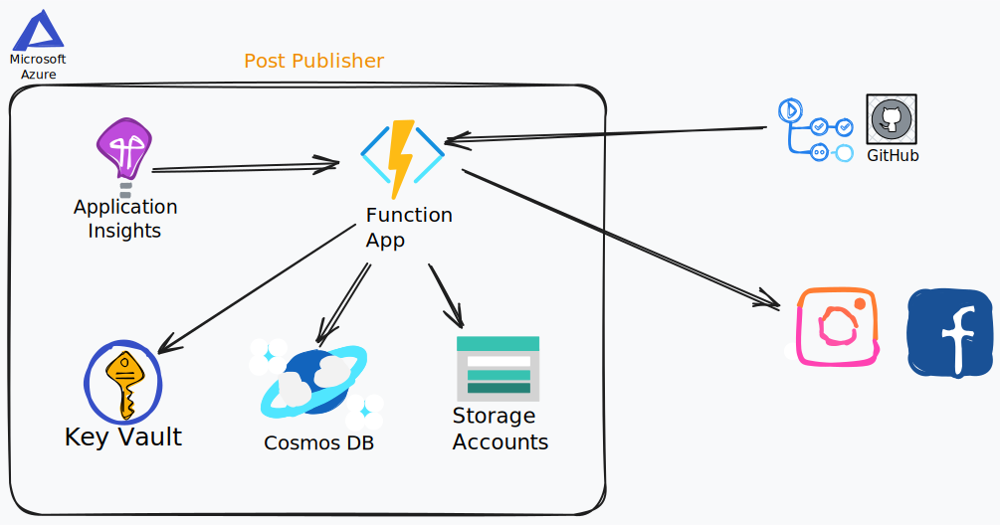
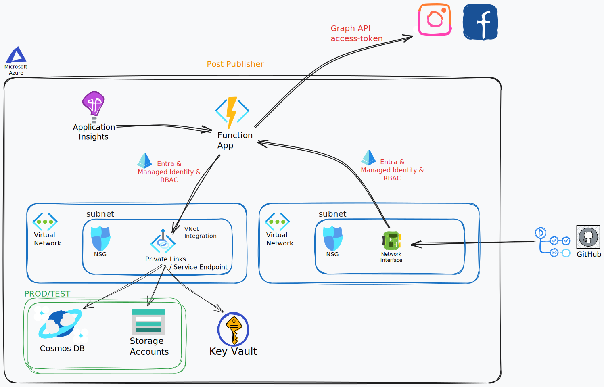

# UUPS - Post Publisher
The "_UUPS - Post Publisher_" application is one of the service components of the UUPS project.

This application is used to periodically publish the approved posts to the configured social media accounts.

It is a time trigger based Azure Function App, which interacts with Blob Storage, Cosmos DB and Key Vault services. Their communication is secured via Microsoft Entra's authentication features, while the actions authorizations are carried out via Azure's Role Based Access Control (RBAC) system. Additionally, the services are further secured via Virtual Network Integration and Service Endpoints (or Private Endpoints for enhanced security).

## Architecture
There were two simple architectures developed for the "_UUPS - Post Publisher_" application:
- Simple architecture with public endpoints
- Secure architecture without public access
    - and without public endpoints (when Private Endpoints are used over Service Endpoints)

The basic architecture cosnsist of the following service components:


- Storage Account: Blob Storage where the generated images are stored.
- Cosmos DB: NoSQL database where the images' metadata and captions for social media are stored.
- Key Vault: Secret store that stores social media account credentials. 
- Function App: an infrastructure plan in which serverless functions are hosted. The main logic of the application is deployed here, which is a time triggered function that binds to the Cosmos DB and Blob Storage Accounts. It publishes posts to social media on configured intervals.
- Application Insights: monitoring tool that collects metrics and logs from the Function App.
- Social Media Accounts: where the images and their captions are published as posts.
- GitHub Actions: CI/CD workflow that deploys application code changes to the Function App.

The communication between the services happen via public IP address endpoints, while the authentication and authorization are through Microsoft Entra ID's Managed Identities and Role Based Access Control (RBAC) mechanisms. 

In this architecture, having public endpoints and enabling public access is completely unnecessary, and opens up the system for attack vectors.
Therefore, the base architecture can be further secured by introducing Virtual Networks as communication filters, through which services can reach each other by utilizing Virtual Network Integration and Service Endpoints (or Private Endpoints).



- Between the Function App and Cosmos DB, Storage Account and Key Vault services a Virtual Network is placed.
- The Cosmos DB, Storage Account and Key Vault services connect to this Virtual Network via setting up Service Endpoints (or Private Endpoints).
- The Virtual Network employs Network Security Groups to filter ingress and egress requests, while the services limit their access solely to this Virtual Network.
- The Function App can request data from these services via setting up VNet Integration.
- Furthermore, to remove the Function App's public endpoint, the GitHub Actions runner can be self-hosted or another Virtual Network bridge can be setup, where GitHub can deploy a Network Interface Card to direct the communication through Azure's private network.
    - By having two separate VNets, the least privilige principle will strengthen the security of the other utilized services.
    - Having a self-hosted runner is better than setting up a whitelisted static IP for GitHub Actions, or penetrating the list of permitted IP addresses for the duration of the deployment. However, using the NIC solution is even better as the runner's maintenance requirements are handled by GitHub.

## Usage
### 1. Provision Azure services
The following Azure services need to be provisioned on Azure:
- Function App
- Storage Account
- Cosmos DB
- Key Vault
- Application Insights

Storage setup considerations:
- In the Storage Account, create a Container named `generated-assets`.
- In the Cosmos DB Account, createa a database named `uups` with a container named `ImageMeta`.
- These can have other names, just don't forget to update their relevant environment variables:
    - `STORAGE_CONTAINER_NAME`
    - `COSMOSDB_DATABASE_NAME`
    - `COSMOSDB_CONTAINER_NAME`

### 2. Setup authentication and authorization
The Azure Function App is built to authenticate with the other services via Microsoft Entra ID's service principal feature. Therefore, a System Managed Identity needs to be created for the Function App to which the other resources can assign their required RBAC rules. Without creating more strict custom rules, the following built-in roles will suffice:
- Storage Account: `Storage Blob Data Contributor`
- Key Vault: `Key Vault Secrets User`
- The Azure Cosmos DB service: `Cosmos DB Built-in Data Reader`.

The `Cosmos DB Built-in Data Reader` might not be visible in Azure Portal, so the following command can be used:
```bash
az cosmosdb sql role assignment create --account-name [database_name] --resource-group [resource_group_name] --scope [scope] --principal-id [object_id] --role-definition-id [role_id]
```
- ``database_name``: the name of the database account
- `resource_group_name`: the name of the resource group in which the database is created
- `scope`: the scope of the role where its permissions are valid. E.g: ``"/subscriptions/<subscription_id>/resourceGroups/<resource_group_name>/providers/Microsoft.DocumentDB/databaseAccounts/<database_name>"``
- `role_id`: the id of the role to be assigned. E.g.: `00000000-0000-0000-0000-000000000001` for the `Cosmos DB Built-in Data Reader`

Furthermore, the Function App needs to have the following Environment Variables present:
- ``STORAGE_ACCOUNT_URL``: The URL of the Storage Account, where the generated images are stored
- ``STORAGE_CONTAINER_NAME``: The name of the container that organizes the blobs within the Storage Account
- ``COSMOSDB_ACCOUNT_URL``: The URL of the Cosmos DB Account, where the images metadata are stored
- ``COSMOSDB_DATABASE_NAME``: The name of the dabase
- ``COSMOSDB_CONTAINER_NAME``: The name of the container (table) inside the database
- ``KEYVAULT_URL``: The URL of the Key Vault that stores the social media secrets
- ``UUPS_ENV``: The environment in which the application operates. Values can be 'test' and 'prod'.

### 3. Store the social media credentials

The Key Vault has to store the credentials of the social media accounts in the following format:
- `[social_media_name]-account-id`: The account id of the social media account
- `[social_media_name]-access-token`: The access token for the account, with necessary priviliges to publish posts

Currently, only Instagram is supported.

Setting the credentials up for Instagram has to be done through Facebook's Graph API, as using third party libraries like `instagrapi` in a serverless infrastructure is unreliable. 
- As the serverless Function App scales to zero its possible outbound IP addresses are changed on restarts. 
- While a whitelisted static outbound IP Address is achievable through VNet NAT Gateway or App Service Environments they are expensive, and the application would still have to solve bot challenges occasionally. 

In order to create the Facebook's Graph API credentials, the following needs to be done:
1. Create an Instagram account (must be either Content Creator or Business) and a Facebook page
2. Connect the Instagram page to the Facebook page
3. Create a Facebook Developer account ([https://developers.facebook.com/](https://developers.facebook.com/))
4. In the Facebook Developer portal add a new Business Application
5. Once created, in the Graph API Explorer Tool create a new Access Token that must have at least the following permissions:
	- ``instagram_basic``
	- ``instagram_content_publish``
6. Then in Access Token Debugger Tool, extend the token's expiration date
7. Finally, you can retrieve the `account-id` via `curl -i -X GET "https://graph.instagram.com/v20.0/me?fields=user_id&access_token=[access_token]"`
8. For more detailed documentation visit the [official developer page](https://developers.facebook.com/docs/instagram-platform/instagram-api-with-instagram-login/get-started)

### 4. Configure the time trigger

Optionally, modify the cron schedule in the `function_app.py` so that the posts will be published at different dates or frequencies.
- By default, one post is published per day at 17:00 (Function App server time).

### 5. Build and Deploy to Function App

Finally, the application code can be built and deployed to the configured Azure Function App. This can be done via either:
- Using VS Code's `Azure Functions` extension (id: ``ms-azuretools.vscode-azurefunctions``), where you have a `Deploy to Function App` feature
- or by executing the following command ``func azure functionapp publish <APP_NAME>``

## CI/CD
Continuous Deployment to the Azure Functions App container happens via GitHub Actions, which is configured in the `./github/workflows/master_publisher.yml` file. Whenever a change is pushed to the `master` branch, the following process goes through:
1. The application is evaluated by the automated unit and integration tests
2. The application is zipped as an artifact
3. GitHub authenticates via OIDC with Azure
4. GitHub deploys the artifact into the Functions App

### 1. Requirements
Azure services need to be provisioned on Azure:
- Storage Account
- Cosmos DB

Storage setup considerations:
- In the Storage Account, create a Container named `generated-assets`.
- In the Cosmos DB Account, createa a database named `uups` with a container named `ImageMeta`.
- These can have other names, just don't forget to update their relevant environment variables:
    - `TEST_STORAGE_CONTAINER_NAME`
    - `TEST_COSMOSDB_DATABASE_NAME`
    - `TEST_COSMOSDB_CONTAINER_NAME`

### 2. Authentication and Authorization
For setting up the authentication and authorization necessary for the integration tests and deployment, the following needs to be done:
1. In Azure, a Service Principal needs to be set up to handle the OIDC authentication with GitHub:
    - It can be done either via creating a new App Registration with a Federated Credential in Microsoft Entra
    - or by creating an User Managed Identity with a Federated Credential in Azure
    - In both cases, the Federated Credential must match the exact parameters of the subject claim that GitHub sends to Azure during the OIDC authentication.
2. The new Service Principal's client ID, along with the relevant tenant ID and subscription ID have to be saved under the repository's `Actions secrets and variables` settings:
    - ``AZURE_CLIENT_ID``: the application's cliend-id
    - ``AZURE_TENANT_ID``: Microsoft Entra's tenant-id
    - ``AZURE_SUBSCRIPTION_ID`` Azure's subscription-id
3. Necessary permissions have to be assigned to this Service Principla via connecting it to a User Group that holds RBAC roles for the relevant services and operations.
    - For deployment to the Function App, the `Website Contributor` role is needed.
    - For integration testing the `Cosmos DB Built-in Data Contributor` and `Storage Blob Data Contributor` role assignments are satisfactory, on the TEST resources' scope.
4. Insert the following secrets under the repository's `Actions secrets and variables`:
    - `TEST_COSMOSDB_ACCOUNT_KEY`: The access key for the test Cosmos DB Account
    - `TEST_STORAGE_CONTAINER_SAS`: The limited permissioned Shared Access Signature (SAS) for the test Blog Storage Container.
5. Insert the following environment variables under the repository's `Actions secrets and variables`:
    - `AZURE_FUNCTION_APP_NAME`: The name of the Function App in Azure. E.g.: `uups-fa`
    - `TEST_COSMOSDB_ACCOUNT_URL`: The URL of the TEST Cosmos DB Account
    - `TEST_COSMOSDB_DATABASE_NAME`: The name of the database
    - `TEST_COSMOSDB_CONTAINER_NAME`: The name of the container inside the database
    - `TEST_STORAGE_ACCOUNT_URL`: The URL of the TEST Storage Account
    - `TEST_STORAGE_CONTAINER_NAME`: The name of the blob container

## Local Development
In order to develop Azure Functions locally, the following needs to be done:
1. Install the ``azure-functions-core-tools-4`` package: [Develop Azure Functions locally using Core Tools](https://learn.microsoft.com/en-us/azure/azure-functions/functions-run-local?tabs=linux%2Cisolated-process%2Cnode-v4%2Cpython-v2%2Chttp-trigger%2Ccontainer-apps&pivots=programming-language-python)
2. Install the [Azure CLI](https://learn.microsoft.com/en-us/cli/azure/install-azure-cli) or [Azure Powershell](https://learn.microsoft.com/en-us/powershell/azure/install-azure-powershell?view=azps-12.2.0)
3. If you are using the Azure CLI, login to Azure from the terminal via `az login` and select the Subscription where the Azure Services are provisioned
4. The developer's Azure account must have the necessary RBAC role assignments for the Azure Services.
    - `Storage Blob Data Contributor`
    - `Cosmos DB Built-in Data Contributor`
- In the ``local.settings.json`` add the following environment variables:
    - ``STORAGE_ACCOUNT_URL``: The URL of the Storage Account, where the generated images are stored
    - ``STORAGE_CONTAINER_NAME``: The name of the container that organizes the blobs within the Storage Account
    - ``COSMOSDB_ACCOUNT_URL``: The URL of the Cosmos DB Account, where the images metadata are stored
    - ``COSMOSDB_DATABASE_NAME``: The name of the dabase
    - ``COSMOSDB_CONTAINER_NAME``: The name of the container (table) inside the database
    - ``KEYVAULT_URL``: The URL of the Key Vault that stores the social media secrets
- For more information, read under the [Azure Functions Python developer guide](https://learn.microsoft.com/en-us/azure/azure-functions/functions-reference-python?tabs=get-started%2Casgi%2Capplication-level&pivots=python-mode-decorators)

## Testing
Regarding automated testing, the `pytest` library is used. 
Therefore, running the unit and integration tests can be done simply via the following command (from the virtual env): `pytest /tests`.

However, before executing the integration tests, the following requirements must be met:
- A TEST Cosmos DB account and a TEST Blob Storage Account needs to be provisioned on Azure
    - Their configuration should mirror closely the PROD services to have efficient tests.
    - Nevertheless, their performance can be minimal, and they can be without scalability, availability and redundancy options.
    - Take care of disabling the Soft-delete feature for Storage Accounts to save unnecessary storage costs.
    - Moreover, go for the Hot-tier as read and write operations will outpace the storage properties.
- Set up the necessary authentication and authorizations:
    - For CI/CD integration testing, read under the [CI/CD](#cicd) section
    - For local testing, read under the [Local Development](#local-development) section
